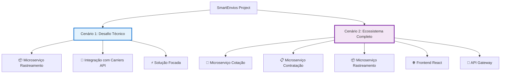

# SmartEnvios - Projeto de Microserviços Logísticos

## 🎯 Visão Geral

Este repositório contém **dois cenários distintos** para o desenvolvimento do sistema SmartEnvios, cada um com objetivos e complexidades diferentes:



---

## 📋 Cenários Disponíveis

### 🔍 **Cenário 1: Desafio Técnico - Microserviço de Rastreamento**
**Diretório**: `scenario-1-tracking-challenge/`

#### **🎯 Objetivo**
Implementar **apenas o microserviço de rastreamento** como um desafio técnico focado, assumindo que os outros microserviços já existem na empresa.

#### **📦 Escopo**
- ✅ **Microserviço de Rastreamento** - Core da solução
- ✅ **Integração Carriers API** - Consulta automática de status
- ✅ **MongoDB** - Armazenamento de eventos
- ✅ **Apache Kafka** - Publicação de eventos
- ✅ **Scheduler** - Verificação periódica
- ✅ **Documentação** - API e arquitetura

---

### 🏗️ **Cenário 2: Ecossistema Completo de Microserviços**
**Diretório**: `scenario-2-complete-ecosystem/`

#### **🎯 Objetivo**
Desenvolver o **sistema completo SmartEnvios** com todos os microserviços, frontend e integrações.

#### **📦 Escopo**
- ✅ **Microserviço de Cotação** - Cálculo de preços
- ✅ **Microserviço de Contratação** - Gestão de contratos
- ✅ **Microserviço de Rastreamento** - Monitoramento automático
- ✅ **Frontend React** - Interface completa
- ✅ **API Gateway** - Orquestração e segurança
- ✅ **Infraestrutura Completa** - MongoDB, Redis, Kafka
- ✅ **Monitoramento** - Prometheus, Grafana
- ✅ **CI/CD** - Pipeline completo

#### **👥 Público-Alvo**
- Desenvolvimento de produto completo
- Implementação em ambiente empresarial
- Arquitetura de microserviços escalável

#### **⏱️ Prazo Estimado**
**45-56 dias úteis** para desenvolvimento completo

---

## 🔄 Comparação dos Cenários

| Aspecto | Cenário 1 (Desafio) | Cenário 2 (Completo) |
|---------|---------------------|----------------------|
| **Complexidade** | 🟡 **Média** | 🔴 **Alta** |
| **Microserviços** | 1 (Rastreamento) | 3 (Cotação + Contratação + Rastreamento) |
| **Frontend** | ❌ Não incluído | ✅ React completo |
| **Infraestrutura** | 🟡 Básica | ✅ Completa |
| **Integrações** | 1 (Carriers API) | 4+ (Carriers, ViaCEP, Payment, Email) |
| **Documentação** | 📄 API específica | 📚 Arquitetural completa |
| **Testes** | 🔍 Unitários | 🔍 Unit + Integration + E2E |
| **Deploy** | 🐳 Docker básico | 🚀 CI/CD completo |

---

## 🚀 Como Começar

### **Para Cenário 1 (Desafio Técnico):**
```bash
cd scenario-1-tracking-challenge/
cat README.md
```

### **Para Cenário 2 (Ecossistema Completo):**
```bash
cd scenario-2-complete-ecosystem/
cat README.md
```

---

## 🎯 Escolhendo o Cenário Ideal

### **✅ Use o Cenário 1 se:**
- Você está em um **processo seletivo**
- Quer **validar competências** específicas de microserviços
- Precisa de uma **prova de conceito** rápida
- Tem **prazo limitado** (1 semana)
- Foca em **qualidade técnica** específica

### **✅ Use o Cenário 2 se:**
- Está desenvolvendo um **produto real**
- Quer uma **arquitetura completa** de microserviços
- Tem **time de desenvolvimento** dedicado
- Planeja **deploy em produção**
- Precisa de **escalabilidade** empresarial

---

## 🏗️ Arquitetura Geral

### **Tecnologias Core (Ambos Cenários)**
- **Backend**: Node.js + TypeScript
- **Banco de Dados**: MongoDB (NoSQL)
- **Message Broker**: Apache Kafka
- **Cache**: Redis
- **Containerização**: Docker + Docker Compose
- **Monitoramento**: Prometheus + Grafana

### **Tecnologias Extras (Cenário 2)**
- **Frontend**: React + Next.js + TypeScript
- **UI Framework**: Ant Design
- **API Gateway**: Express.js com middleware
- **CI/CD**: GitHub Actions
- **Observabilidade**: Jaeger (tracing)

---

## 📚 Documentação

### **Compartilhada**
- **Regras de Desenvolvimento**: `.cursor/rules/` - Padrões de código automatizados
- **Carriers API**: Documentação da integração externa

### **Específica por Cenário**
- **Cenário 1**: Foco na API de rastreamento e arquitetura simples
- **Cenário 2**: Documentação arquitetural completa (ADRs, PRDs, C4)

---

## 🤝 Contribuindo

### **Estrutura de Commits**
```bash
# Cenário 1
git commit -m "feat(tracking): adiciona endpoint de verificação automática"

# Cenário 2  
git commit -m "feat(quotation): implementa cálculo de frete express"
```

### **Convenções**
- **Prefixos**: `feat`, `fix`, `docs`, `test`, `refactor`
- **Escopos**: `tracking`, `quotation`, `contract`, `frontend`, `infra`
- **Descrição**: Português claro e objetivo

---

## 📞 Suporte

### **Dúvidas Técnicas**
- Consulte o README específico de cada cenário
- Verifique a documentação em `docs/` (Cenário 2)
- Revise as regras automatizadas em `.cursor/rules/`

### **Decisões Arquiteturais**
- **Cenário 1**: Foco na simplicidade e eficiência
- **Cenário 2**: Consulte os ADRs (Architecture Decision Records)

---

## 🎖️ Status dos Cenários

| Cenário | Status | Progresso | Próximo Passo |
|---------|--------|-----------|---------------|
| **Cenário 1** | 🟡 Em Preparação | 0% | Setup inicial |
| **Cenário 2** | 🟡 Em Preparação | 0% | Migração da documentação |

---

**Escolha seu cenário e comece a desenvolver! 🚀**
