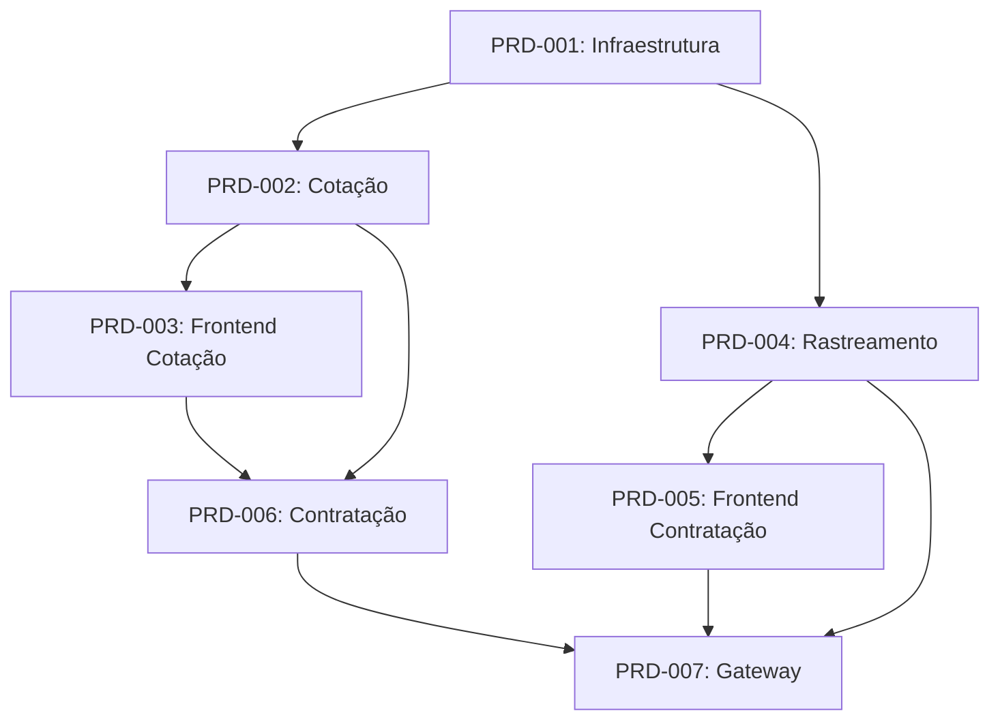

# Product Requirements Documents (PRDs) - SmartEnvios

Este diretório contém todos os PRDs (Product Requirements Documents) do projeto SmartEnvios, organizados por etapa de desenvolvimento.

## 📋 Visão Geral

O projeto SmartEnvios é uma plataforma completa de microserviços para cotação, contratação e rastreamento de fretes, com frontend moderno e integração com transportadoras.

## 🗂️ Lista de PRDs

### **Infraestrutura e Base**
- **[PRD-001: Setup e Infraestrutura Base](./PRD-001-Setup-Infraestrutura-Base.md)**
  - Configuração inicial do ambiente
  - Docker, MongoDB, Kafka, Redis
  - CI/CD e monitoramento base
  - **Duração**: 5-7 dias

### **Backend - Microserviços**
- **[PRD-002: Microserviço de Cotação de Fretes](./PRD-002-Microservico-Cotacao-Fretes.md)**
  - API de cotação com cache
  - Integração com API Carriers
  - Validações e otimizações
  - **Duração**: 6-8 dias

- **[PRD-004: Microserviço de Rastreamento](./PRD-004-Microservico-Rastreamento.md)**
  - Rastreamento automatizado
  - Scheduler e intervalos dinâmicos
  - Event-driven architecture
  - **Duração**: 7-9 dias

- **[PRD-006: Microserviço de Contratação](./PRD-006-Microservico-Contratacao.md)**
  - Gestão completa de contratos
  - Geração de documentos
  - Integração com transportadoras
  - **Duração**: 8-10 dias

### **Frontend - Interface do Usuário**
- **[PRD-003: Frontend - Tela de Cotação](./PRD-003-Frontend-Tela-Cotacao.md)**
  - Interface React + TypeScript
  - Formulários com validação
  - Context API e Ant Design
  - **Duração**: 5-6 dias

- **[PRD-005: Frontend - Tela de Contratação](./PRD-005-Frontend-Tela-Contratacao.md)**
  - Fluxo completo de contratação
  - Stepper multi-etapas
  - Validações de documentos
  - **Duração**: 6-7 dias

### **Integração e Deploy**
- **[PRD-007: API Gateway e Integração Final](./PRD-007-API-Gateway-Integracao.md)**
  - Gateway centralizado
  - Autenticação e rate limiting
  - Testes end-to-end
  - **Duração**: 8-10 dias

## 🔄 Ordem de Execução Recomendada

### **Etapa 1: Fundação** (5-7 dias)
1. PRD-001: Setup e Infraestrutura Base

### **Etapa 2: Core Services** (13-17 dias - paralelo)
2. PRD-002: Microserviço de Cotação *(6-8 dias)*
3. PRD-004: Microserviço de Rastreamento *(7-9 dias)*

### **Etapa 3: Frontend Base** (5-6 dias)
4. PRD-003: Frontend - Tela de Cotação

### **Etapa 4: Contratação Completa** (14-17 dias - paralelo)
5. PRD-006: Microserviço de Contratação *(8-10 dias)*
6. PRD-005: Frontend - Tela de Contratação *(6-7 dias)*

### **Etapa 5: Integração Final** (8-10 dias)
7. PRD-007: API Gateway e Integração Final

## 📊 Cronograma Total

| Etapa | Duração | Início | Término |
|-------|---------|--------|---------|
| Infraestrutura | 5-7 dias | Semana 1 | Semana 2 |
| Core Services | 13-17 dias | Semana 2 | Semana 4 |
| Frontend Base | 5-6 dias | Semana 3 | Semana 4 |
| Contratação | 14-17 dias | Semana 4 | Semana 6 |
| Integração | 8-10 dias | Semana 6 | Semana 7 |

**Duração Total Estimada**: 45-57 dias úteis (9-11 semanas)

## 🎯 Marcos Importantes

### **Marco 1**: Infraestrutura Pronta (Semana 2)
- ✅ Ambiente de desenvolvimento configurado
- ✅ CI/CD pipeline funcionando
- ✅ Monitoramento básico implementado

### **Marco 2**: MVP de Cotação (Semana 4)
- ✅ API de cotação funcionando
- ✅ Frontend de cotação operacional
- ✅ Integração com Carriers API

### **Marco 3**: Sistema Completo (Semana 6)
- ✅ Contratação end-to-end funcionando
- ✅ Rastreamento automatizado ativo
- ✅ Documentação completa

### **Marco 4**: Produção Ready (Semana 7)
- ✅ Gateway em produção
- ✅ Testes end-to-end passando
- ✅ Monitoramento completo

## 🔧 Stack Tecnológica

### **Backend**
- **Runtime**: Node.js 20+ com TypeScript
- **Frameworks**: Express.js, Fastify
- **Database**: MongoDB com Mongoose
- **Cache**: Redis
- **Messaging**: Apache Kafka
- **Testing**: Jest + Supertest

### **Frontend**
- **Framework**: React 18+ com TypeScript
- **Build**: Vite
- **UI**: Ant Design v5
- **Styling**: SASS/SCSS
- **State**: Context API + useReducer
- **Forms**: React Hook Form + Zod

### **Infrastructure**
- **Containerization**: Docker + Docker Compose
- **Orchestration**: Kubernetes (futuro)
- **CI/CD**: GitHub Actions
- **Monitoring**: Prometheus + Grafana + Jaeger
- **Logging**: Winston + ELK Stack (futuro)

## 📈 Métricas de Sucesso

### **Performance**
- Tempo de resposta < 2s para cotações
- Throughput > 1000 req/min
- Uptime > 99.9%

### **Qualidade**
- Cobertura de testes > 80%
- Zero vulnerabilidades críticas
- Documentação 100% atualizada

### **Negócio**
- Conversion rate > 85% (cotação → contratação)
- Error rate < 1%
- Customer satisfaction > 4.5/5

## 🔍 Como Usar Esta Documentação

1. **Para Product Managers**: Use os PRDs para entender escopo, cronograma e critérios de aceitação
2. **Para Desenvolvedores**: Consulte as especificações técnicas e entregáveis de cada PRD
3. **Para QA**: Use os critérios de aceitação e cenários de teste
4. **Para DevOps**: Foque nos PRDs 001 e 007 para infraestrutura

## ⚠️ Dependências Críticas

- **API Carriers**: Token e documentação atualizados
- **Figma**: Designs finalizados antes do desenvolvimento frontend
- **Ambiente**: Acesso aos recursos de infraestrutura necessários

## 📞 Contatos

- **Tech Lead**: Responsável por decisões arquiteturais
- **Product Owner**: Aprovação de critérios de aceitação
- **DevOps**: Configuração de infraestrutura e deploy

---

**Última Atualização**: Janeiro 2025  
**Versão**: 1.0  
**Status**: Aprovado
