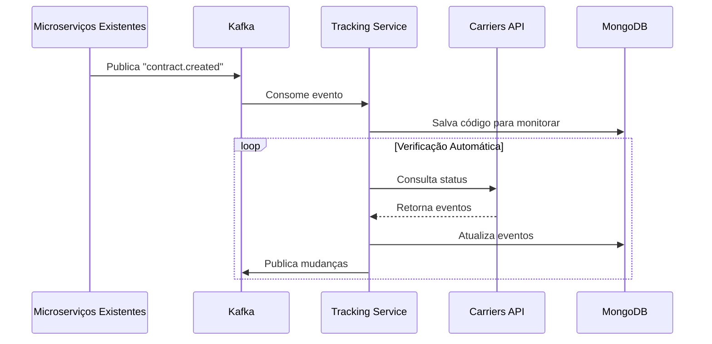

# ADR-001: Arquitetura do Microserviço de Rastreamento

## Status
**Aceito** - Janeiro 2025

## Contexto

Este ADR documenta as decisões arquiteturais específicas para o **Microserviço de Rastreamento** no contexto de um desafio técnico, onde os microserviços de Cotação e Contratação já existem na empresa. O objetivo é automatizar o processo de rastreio de pedidos utilizando a API da transportadora "Carriers".

### Cenário Específico
- **Microserviços existentes**: Cotação e Contratação já implementados
- **Foco**: Automatização de rastreamento via API Carriers
- **Integração**: Com sistemas legados via Kafka
- **Prazo**: 6 dias úteis (desafio técnico)

## Decisão

Implementaremos um microserviço standalone de rastreamento seguindo os princípios de Domain Driven Design (DDD) e Event-Driven Architecture, otimizado para integração com sistemas existentes.

## Arquitetura da Solução

### Componentes Principais

#### 1. **Core do Microserviço**
```
tracking-service/
├── src/
│   ├── domain/          # TrackingCode, TrackingEvent, TrackingStatus
│   ├── application/     # AddTrackingUseCase, UpdateTrackingUseCase
│   ├── infrastructure/  # MongoDB, Kafka, Carriers API
│   └── presentation/    # REST Controllers, DTOs
├── tests/              # Unit + Integration + E2E
├── docs/               # OpenAPI specs
└── Dockerfile
```

#### 2. **Integrações Externas**
- **API Carriers**: Fonte de dados de rastreamento
- **Apache Kafka**: Comunicação com microserviços existentes
- **MongoDB**: Persistência de códigos e eventos
- **Redis**: Cache e rate limiting

#### 3. **Componentes de Automação**
- **Scheduler**: Jobs cron para verificações periódicas
- **Event Consumer**: Processa novos códigos dos outros microserviços
- **Event Publisher**: Notifica mudanças de status

### Fluxo Principal



## Principais Decisões Técnicas

### 1. **Arquitetura de Domínio**

#### **Domain Driven Design (DDD)**
- **Aggregate Root**: `TrackingCode` - Entidade principal
- **Entities**: `TrackingEvent` - Eventos de rastreamento
- **Value Objects**: `TrackingStatus`, `Location`, `CarrierInfo`
- **Domain Services**: `TrackingIntervalStrategy`, `EventMappingService`

```typescript
// Exemplo da entidade principal
class TrackingCode {
  constructor(
    public readonly id: TrackingCodeId,
    public readonly code: string,
    public readonly carrier: string,
    private status: TrackingStatus,
    private events: TrackingEvent[],
    private metadata: TrackingMetadata
  ) {}
  
  updateStatus(newEvents: TrackingEvent[]): void {
    // Regras de negócio para atualização
    this.events.push(...newEvents);
    this.status = this.deriveStatusFromEvents();
    this.calculateNextCheckInterval();
  }
}
```

#### **Event-Driven Architecture**
- **Eventos de Input**: `contract.created`, `quote.converted`
- **Eventos de Output**: `tracking.status.updated`, `tracking.delivered`
- **Event Sourcing**: Histórico completo de mudanças
- **Eventual Consistency**: Tolerância a latência entre serviços

### 2. **Integração com API Carriers**

#### **HTTP Client Resiliente**
```typescript
class CarriersTrackingClient {
  private readonly httpClient: AxiosInstance;
  
  constructor() {
    this.httpClient = axios.create({
      baseURL: 'http://api.carriers.com.br',
      timeout: 15000,
      headers: {
        'Authorization': `Bearer ${process.env.CARRIERS_API_TOKEN}`
      }
    });
    
    // Interceptors para retry e circuit breaker
    this.setupInterceptors();
  }
  
  async trackShipment(code: string): Promise<CarriersResponse> {
    return await this.httpClient.get(`/client/Carriers/Tracking/${code}`);
  }
}
```

#### **Rate Limiting Strategy**
- **Limite**: 100 req/min (conforme API Carriers)
- **Implementação**: Redis-based sliding window
- **Backoff**: Exponencial em caso de 429 errors
- **Batch Processing**: Agrupar requests por transportadora

### 3. **Persistência de Dados**

#### **MongoDB Schema Design**
```javascript
// TrackingCode Collection
{
  _id: ObjectId,
  code: "SM82886187440BM",
  carrier: "Carriers",
  status: "in_transit",
  contractId: "12345",
  customerId: "customer_123",
  isActive: true,
  lastCheckedAt: ISODate,
  nextCheckAt: ISODate,
  checkInterval: 1800, // segundos
  events: [
    {
      id: "evt_001",
      timestamp: ISODate,
      status: "posted",
      location: "São Paulo, SP",
      description: "Objeto postado",
      isDelivered: false,
      carrierRawData: {} // Dados originais da API
    }
  ],
  metadata: {
    errorCount: 0,
    totalChecks: 47,
    estimatedDelivery: ISODate
  }
}

// Índices para performance
db.tracking_codes.createIndex({ code: 1 }, { unique: true });
db.tracking_codes.createIndex({ nextCheckAt: 1, isActive: 1 });
db.tracking_codes.createIndex({ carrier: 1, status: 1 });
```

#### **Justificativas MongoDB**
- **Flexibilidade**: Eventos podem ter estruturas diferentes por transportadora
- **Performance**: Índices otimizados para queries de rastreamento
- **Escalabilidade**: Sharding natural por código de rastreamento
- **TTL**: Limpeza automática de dados antigos

### 4. **Sistema de Agendamento**

#### **Scheduler Inteligente**
```typescript
class TrackingScheduler {
  private readonly intervalStrategy = new TrackingIntervalStrategy();
  
  async processPendingCodes(): Promise<void> {
    const pendingCodes = await this.trackingRepository.findPendingCodes();
    
    // Processamento em lotes para otimizar rate limits
    const batches = this.createBatches(pendingCodes, 10);
    
    for (const batch of batches) {
      await Promise.allSettled(
        batch.map(code => this.processTrackingCode(code))
      );
      
      await this.sleep(1000); // 1s entre lotes
    }
  }
}
```

#### **Estratégia de Intervalos**
- **Status-based**: Intervalos diferentes por status
  - `posted`: 5 minutos
  - `in_transit`: 30 minutos  
  - `out_for_delivery`: 10 minutos
  - `delivered`: 0 (para verificação)
- **Error-based**: Backoff exponencial para códigos com erro
- **Age-based**: Intervalos maiores para códigos antigos

### 5. **Observabilidade e Monitoramento**

#### **Métricas Prometheus**
```typescript
const trackingMetrics = {
  requestsTotal: new Counter({
    name: 'tracking_requests_total',
    labelNames: ['carrier', 'status', 'operation']
  }),
  
  updateDuration: new Histogram({
    name: 'tracking_update_duration_seconds',
    labelNames: ['carrier', 'success']
  }),
  
  activeCodesGauge: new Gauge({
    name: 'tracking_codes_active',
    labelNames: ['carrier', 'status']
  })
};
```

#### **Health Checks**
- **Database**: MongoDB connectivity
- **External API**: Carriers API health
- **Message Broker**: Kafka producer/consumer status
- **Cache**: Redis connectivity

## Benefícios da Arquitetura

### 1. **Isolamento e Autonomia**
- **Deploy independente** dos outros microserviços
- **Escala horizontal** baseada apenas na demanda de rastreamento
- **Tecnologia específica** otimizada para o domínio

### 2. **Resiliência**
- **Circuit breaker** para API Carriers
- **Retry logic** com backoff exponencial
- **Graceful degradation** em caso de falhas
- **Event sourcing** para recuperação de estado

### 3. **Performance**
- **Cache inteligente** baseado no status
- **Batch processing** para otimizar rate limits
- **Índices MongoDB** otimizados para queries
- **Lazy loading** de dados não críticos

### 4. **Manutenibilidade**
- **Domain-centric** code organization
- **Clean architecture** com separação de camadas
- **Comprehensive testing** (>80% coverage)
- **Self-documenting** code com OpenAPI

## Riscos e Mitigações

| Risco | Probabilidade | Impacto | Mitigação |
|-------|---------------|---------|-----------|
| Rate limiting da API Carriers | Alta | Médio | Backoff exponencial + cache |
| Volume alto de códigos | Média | Alto | Processamento em lotes + scaling |
| Latência de rede | Média | Médio | Cache + timeout otimizado |
| Dados inconsistentes | Baixa | Alto | Validação rigorosa + reconciliação |

## Alternativas Consideradas

### 1. **Polling vs Webhooks**
- **Escolhido**: Polling com intervalos inteligentes
- **Rejeitado**: Webhooks (não disponível na API Carriers)
- **Justificativa**: Controle total sobre rate limits e recovery

### 2. **SQL vs NoSQL**
- **Escolhido**: MongoDB (NoSQL)
- **Rejeitado**: PostgreSQL
- **Justificativa**: Eventos semi-estruturados + performance

### 3. **Synchronous vs Asynchronous**
- **Escolhido**: Event-driven (assíncrono)
- **Rejeitado**: REST calls diretos
- **Justificativa**: Desacoplamento + scalability

## Implementação

### Fases de Desenvolvimento

#### **Fase 1: Core Infrastructure (2 dias)**
- Setup projeto + Docker Compose
- Modelos de domínio + repositories
- Integração básica com Carriers API

#### **Fase 2: Business Logic (2 dias)**
- Use cases principais
- Sistema de scheduling
- Event publishing/consuming

#### **Fase 3: API & Integration (1 dia)**
- REST endpoints
- Validações e middlewares
- Health checks

#### **Fase 4: Quality Assurance (1 dia)**
- Testes automatizados
- Métricas e observabilidade
- Documentação final

### Critérios de Aceitação

1. **Funcional**: Rastrear códigos automaticamente
2. **Performance**: 1000+ códigos/hora processados
3. **Reliability**: >99.9% uptime
4. **Quality**: >80% test coverage
5. **Integration**: Kafka events funcionando

## Próximos Passos

1. **Setup inicial**: Estrutura do projeto + Docker Compose
2. **Implementação**: Seguir fases definidas
3. **Testes**: Validação com códigos reais da Carriers
4. **Deploy**: Ambiente de desenvolvimento
5. **Documentação**: OpenAPI + guias operacionais

## Evolução Futura

### Possíveis Melhorias
- **Multi-carrier support**: Outros além da Carriers
- **ML predictions**: Estimativa de entrega baseada em histórico
- **Real-time notifications**: WebSockets para updates
- **Analytics dashboard**: Métricas de performance por transportadora

### Considerações de Escala
- **Database sharding**: Por região geográfica
- **Read replicas**: Para queries de consulta
- **Event streaming**: Kafka Streams para processamento
- **Microservice splitting**: Separar por transportadora

---

**Autores**: Equipe de Desenvolvimento SmartEnvios  
**Data**: Janeiro 2025  
**Versão**: 1.0  
**Próxima Revisão**: Após implementação (6 dias úteis)
