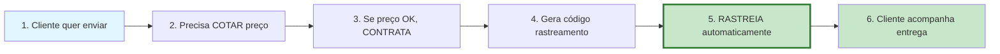
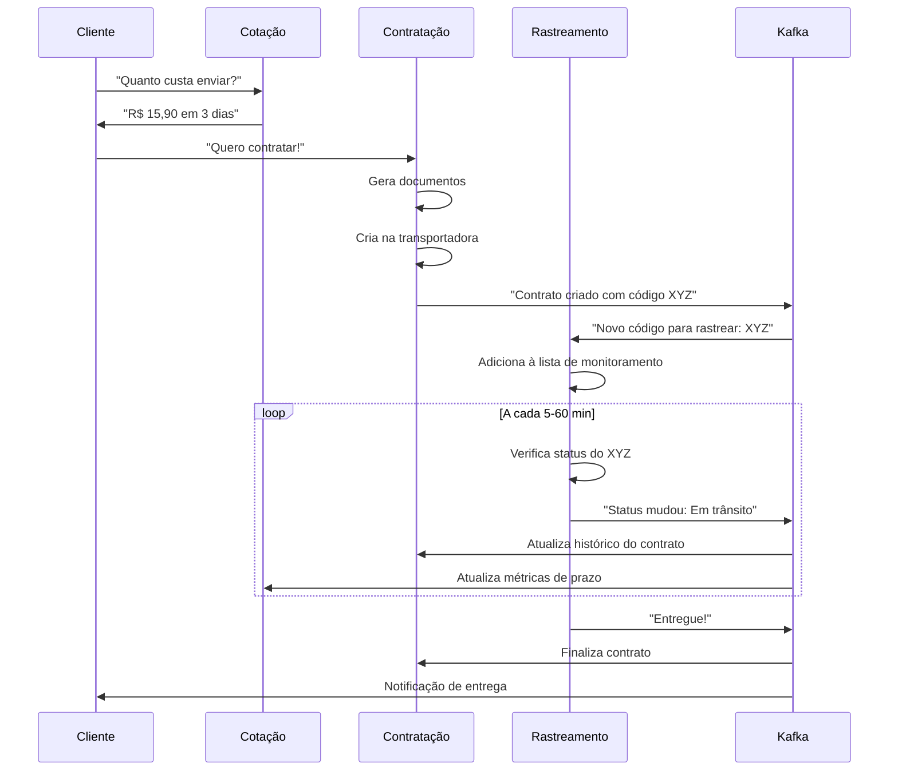

# 🏗️ Estratégia de Microserviços SmartEnvios

## 📋 Índice
- [Por Que Múltiplos Microserviços?](#-por-que-múltiplos-microserviços)
- [Relação Entre os Serviços](#-relação-entre-os-serviços)
- [Análise de Cada Microserviço](#-análise-de-cada-microserviço)
- [Sinergia do Ecossistema](#-sinergia-do-ecossistema)
- [Por Que NÃO Um Serviço Único](#-por-que-não-um-serviço-único)
- [Conclusão Estratégica](#-conclusão-estratégica)

---

## 🤔 Por Que Múltiplos Microserviços?

### **Contexto do Objetivo Principal**
O objetivo central é **automatizar o processo de rastreio de pedidos** utilizando a API da transportadora "Carriers". Mas para que o rastreamento tenha valor real, precisamos de um **ecossistema completo** que gere e gerencie os códigos de rastreamento.

### **O Fluxo Natural do Negócio**


### **🚫 O Problema Se Tivéssemos Só Rastreamento**

**Cenário hipotético**: Cliente tem código de rastreamento `SM123456789BR`
- ❓ **De onde veio este código?**
- ❓ **Quem contratou?**
- ❓ **Quanto custou?**
- ❓ **Quais produtos estão sendo enviados?**
- ❓ **Para onde vai?**

**Resultado**: Rastreamento "órfão" sem contexto de negócio!

---

## 🔄 Relação Entre os Serviços

### **Fluxo de Integração Completo**


---

## 🔍 Análise de Cada Microserviço

### **1. 🧮 Microserviço de COTAÇÃO - "O Vendedor"**

#### **🎯 Responsabilidade Principal**
- Calcular preços em tempo real
- Comparar múltiplas transportadoras  
- Cachear resultados para performance
- Validar origem/destino

#### **🏗️ Por Que Separado**
```typescript
// Cenários diferentes requerem lógicas diferentes
interface QuoteScenarios {
  businessCustomer: {
    discounts: number[];
    volumeRules: VolumeRule[];
    creditTerms: string;
  };
  
  ecommerce: {
    realTimeCalculation: boolean;
    multipleOptions: boolean;
    cacheStrategy: CacheConfig;
  };
  
  marketplace: {
    sellerIntegration: boolean;
    feeCalculation: FeeRule[];
    bulkProcessing: boolean;
  };
}
```

#### **📊 Exemplos Reais de Uso**
- **Mercado Livre**: Milhões de cotações/dia, precisa ser MUITO rápido
- **Loja física**: Algumas cotações/dia, pode ser mais lenta mas precisa ser precisa
- **B2B**: Regras de desconto complexas baseadas no volume

**⚠️ Problema se misturar com rastreamento**: Performance de cotação seria prejudicada pelos jobs de rastreamento rodando constantemente.

---

### **2. 📋 Microserviço de CONTRATAÇÃO - "O Cartório"**

#### **🎯 Responsabilidade Principal**
- Transformar cotação em contrato real
- Gerar documentação fiscal
- Integrar com transportadora 
- Gerir ciclo de vida do contrato

#### **🏗️ Por Que Separado**
```typescript
interface ContractComplexity {
  legalRequirements: {
    fiscalDocuments: string[];
    digitalSignature: boolean;
    complianceRules: Rule[];
  };
  
  businessRules: {
    creditApproval: ApprovalProcess;
    paymentTerms: PaymentConfig;
    cancellationPolicy: CancellationRule[];
  };
  
  integrations: {
    carriersAPI: CarrierIntegration[];
    fiscalServices: FiscalService[];
    paymentGateways: PaymentGateway[];
  };
}
```

#### **📊 Exemplos Reais de Uso**
- **Contrato B2B**: Pode levar dias para aprovação, múltiplas assinaturas
- **E-commerce**: Aprovação instantânea, pagamento na hora
- **Marketplace**: Regras diferentes por seller

**⚠️ Problema se misturar com rastreamento**: Quando o rastreamento "acordasse" a cada 5 minutos, perturbaria processos de contratação que podem estar "dormindo" por horas/dias.

---

### **3. 📦 Microserviço de RASTREAMENTO - "O Detetive"**

#### **🎯 Responsabilidade Principal (Core do Objetivo)**
- Monitorar códigos automaticamente
- Otimizar intervalos de verificação
- Detectar mudanças de status
- Publicar eventos para o sistema

#### **🏗️ Por Que Isolado**
```typescript
interface TrackingChallenges {
  scalability: {
    millionsOfCodes: boolean;
    continuousPolling: boolean;
    rateLimitManagement: boolean;
  };
  
  performance: {
    intelligentIntervals: boolean;
    cacheOptimization: boolean;
    batchProcessing: boolean;
  };
  
  reliability: {
    errorRecovery: boolean;
    circuitBreaker: boolean;
    deadLetterQueue: boolean;
  };
}
```

#### **📊 Exemplo Prático - E-commerce**

**1. Cliente no site:**
```
12:00 - Cotação: "Frete para 01234-567? R$ 12,50"
12:05 - Contratação: "Pedido #789 confirmado, código SM123BR"
12:10 - Rastreamento: Adiciona SM123BR para monitorar
```

**2. Ao longo dos dias:**
```
Dia 1, 18:00 - Rastreamento: "Postado" → Kafka → Cliente notificado
Dia 2, 10:30 - Rastreamento: "Em trânsito" → Kafka → Cliente notificado  
Dia 3, 14:15 - Rastreamento: "Entregue" → Kafka → Contrato finalizado
```

**3. Relatórios gerenciais:**
```
- Cotação: "Conversion rate de 85% hoje"
- Contratação: "120 contratos finalizados"  
- Rastreamento: "Prazo médio: 2,8 dias"
```

---

## 🎯 Sinergia do Ecossistema

### **🔗 Como os Microserviços Trabalham Juntos**

#### **📈 Métricas Cruzadas**
```typescript
interface CrossServiceMetrics {
  cotacao: {
    conversionRate: number; // % que viram contratos
    averageQuoteTime: number; // Tempo médio de resposta
    accuracyRate: number; // % de cotações que batem com prazo real
  };
  
  contratacao: {
    approvalTime: number; // Tempo médio de aprovação
    cancellationRate: number; // % de contratos cancelados
    documentCompleteness: number; // % docs preenchidos corretamente
  };
  
  rastreamento: {
    deliveryAccuracy: number; // % entregas no prazo cotado
    averageDeliveryTime: number; // Prazo real médio
    exceptionRate: number; // % códigos com problemas
  };
}
```

#### **🔄 Feedback Loop Inteligente**
1. **Rastreamento** detecta atrasos frequentes de uma transportadora
2. **Cotação** ajusta automaticamente os prazos para essa transportadora
3. **Contratação** pode sugerir transportadoras alternativas
4. **Cliente** recebe estimativas mais precisas

### **🎪 Analogia Final**
- **Cotação** = Vendedor que atrai clientes e gera interesse
- **Contratação** = Cartório que oficializa e cria os casos
- **Rastreamento** = Detetive que acompanha e entrega valor

**Sem os dois primeiros, o rastreamento seria inútil** - seria como ter um detetive excelente mas sem nenhum caso para investigar!

---

## ❌ Por Que NÃO Um Serviço Único

### **🔥 Problemas de um "SuperServiço"**

#### **1. Conflito de Performance**
```typescript
// Rastreamento precisa rodar a cada minuto
setInterval(() => checkAllTrackingCodes(), 60000);

// Cotação precisa responder em < 500ms  
app.post('/quote', fastResponse);

// Contratação pode levar 30+ segundos
app.post('/contract', slowButSecureProcess);
```
**Resultado**: Scheduler do rastreamento atrapalharia cotações rápidas!

#### **2. Escalabilidade Diferente**
| Serviço | Pico de Demanda | Padrão de Uso |
|---------|----------------|---------------|
| **Cotação** | 10.000 req/min (Black Friday) | Burst intenso |
| **Contratação** | 100 req/min | Steady, poucos picos |
| **Rastreamento** | 1 req/min por código | Background contínuo |

**Problema**: Com um serviço, precisaria escalar para o pior caso (cotação) mesmo quando só está rastreando.

#### **3. Times e Expertises Diferentes**
- **Cotação**: Time de pricing, algoritmos complexos de precificação
- **Contratação**: Time jurídico, compliance, integrações fiscais
- **Rastreamento**: Time de automação, background jobs, polling

#### **4. Ciclos de Deploy Diferentes**
- **Cotação**: Deploy várias vezes/dia (A/B tests de preço)
- **Contratação**: Deploy semanal (muito crítico, compliance)
- **Rastreamento**: Deploy conforme necessário (estabilidade)

#### **5. Tecnologias Diferentes**
```typescript
interface OptimalTechStack {
  cotacao: {
    cache: "Redis com TTL curto";
    database: "Read replicas para performance";
    computing: "CPU otimizado para cálculos";
  };
  
  contratacao: {
    database: "ACID compliance, backup frequente";
    security: "Criptografia, audit trail";
    integrations: "Circuit breakers robustos";
  };
  
  rastreamento: {
    scheduler: "Background job queue";
    rateLimiting: "Throttling inteligente";
    errorHandling: "Retry exponencial";
  };
}
```

---

## 🎯 Conclusão Estratégica

### **✅ A Decisão de usar 3 microservices Está CORRETA**

#### **🎯 Rastreamento É o Core Técnico**
- o **Microserviço de Rastreamento** é realmente o que mais se alinha com o objetivo principal de "automatizar o processo de rastreio".

#### **🏗️ Mas o Ecossistema É Fundamental**
Os outros microserviços existem para **criar o contexto e valor** que torna o rastreamento útil:

1. **📊 Cotação** = **Gera o pipeline** de clientes interessados
2. **📋 Contratação** = **Cria os códigos** que o rastreamento vai monitorar  
3. **📦 Rastreamento** = **Entrega o valor** automatizando o acompanhamento

### **🚀 Resultado Final**
O objetivo principal é automatizar rastreamento, **MAS** para ter o que rastrear, você precisa do **ecossistema completo** que gera e gerencia os códigos de rastreamento.

É essa sinergia que transforma um simples "verificador de status" em uma **plataforma logística completa**!

### **📈 Valor Entregue**
- **Para o Cliente**: Experiência completa de cotação → contratação → acompanhamento
- **Para o Negócio**: Automação do processo mais crítico (rastreamento) + geração de receita (cotação/contratação)
- **Para a Arquitetura**: Separação clara de responsabilidades, escalabilidade independente, times especializados

---

## 📚 Referências

- [ADR-001: Decisões Arquiteturais](../adrs/ADR-001-SmartEnvios-Microservices-Architecture.md)
- [PRD-002: Microserviço de Cotação](../prds/PRD-002-Microservico-Cotacao-Fretes.md)
- [PRD-004: Microserviço de Rastreamento](../prds/PRD-004-Microservico-Rastreamento.md)
- [PRD-006: Microserviço de Contratação](../prds/PRD-006-Microservico-Contratacao.md)
- [Diagramas C4 da Arquitetura](../../README.md#arquitetura-c4---diagramas-do-sistema)
